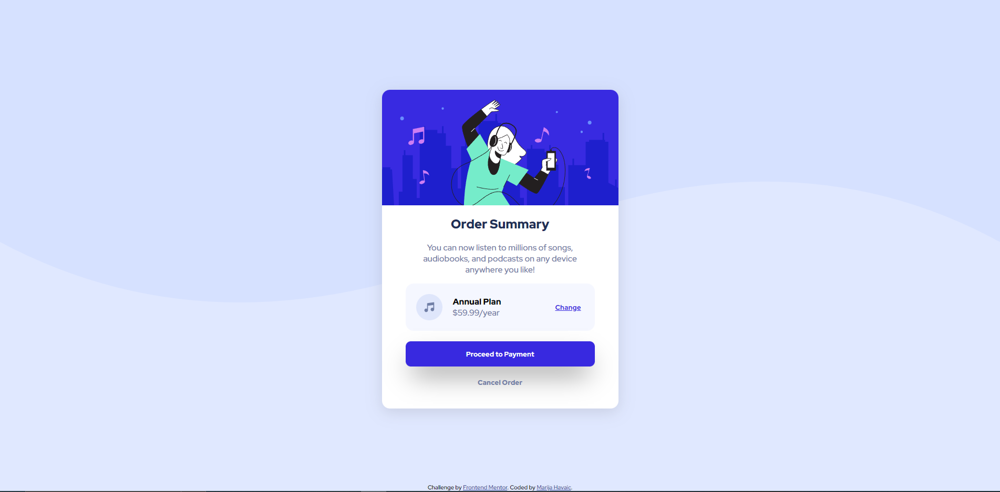
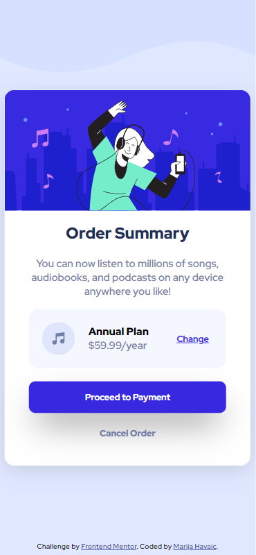

# Frontend Mentor - Order summary card solution

This is a solution to the [Order summary card challenge on Frontend Mentor](https://www.frontendmentor.io/challenges/order-summary-component-QlPmajDUj). Frontend Mentor challenges help you improve your coding skills by building realistic projects. 

## Table of contents

- [Overview](#overview)
  - [The challenge](#the-challenge)
  - [Screenshot](#screenshot)
  - [Links](#links)
- [My process](#my-process)
  - [Built with](#built-with)
  - [What I learned](#what-i-learned)
  - [Continued development](#continued-development)
  - [Useful resources](#useful-resources)
- [Author](#author)
- [Acknowledgments](#acknowledgments)

## Overview

### The challenge

Users should be able to:

- See hover states for interactive elements

### Screenshots
##### Desktop Version

##### Mobile Version


### Links

- Solution URL: [Github](https://www.frontendmentor.io/solutions/order-summary-card-solution-kXdFttYanW)
- Live Site URL: [Github Pages](https://marijahavaic.github.io/frontend-mentor-order-summary-component/)
- Source Code URL: [Github](https://github.com/marijahavaic/frontend-mentor-order-summary-component)

## My process

### Built with

- Semantic HTML5 markup
- CSS custom properties
- Flexbox
- Mobile-first workflow

### What I learned
I learned how to pay attention on how the website was designed. First, I destructured the website by breaking into HTML elements, then I looked at what elements have the same characteristics. For example: the whole page has the same font, so I applied it to the whole page * (all types of elements in an HTML page).

```css
* {
    font-family: "Red Hat Display", serif;
    box-sizing: border-box;
}
```

### Continued development

- Button Animation

## Author

- Website - [Marija Havaic](https://www.marijahavaic.com)
- Frontend Mentor - [@marijahavaic](https://www.frontendmentor.io/profile/marijahavaic)
